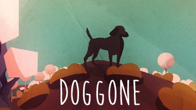

# About Me

Van has been passionately exploring game development their whole life. Ever since they received a hand-me-down Atari 2600 as a child, they've pondered how games can be made better, more fun, and more inclusive. Van would eventually graduate from the University of Louisiana at Lafayette with a BS in Computer Science and a concentration in Game Design and Development. They later co-founded Wisp Entertainment, where they were the sole programmer and designer for The Legend of Excalipurr. Van now teaches game programming at the Academy of Interactive Entertainment in Lafayette, Louisiana.

## Resume

* [PDF](https://raw.githubusercontent.com/vanPhelan/vanPhelan/main/resume.pdf)

# Projects

## DOGGONE

DOGGONE is a game from Raconteur Games. I primarily programmed the dog itself, but I also had a hand in many of the smaller systems in place, as well as a bit of technical art.

* [Steam Page](https://store.steampowered.com/app/1662540/DOGGONE/)

## The Legend of Excalipurr

The Legend of Excalipurr is a retro action adventure game for which I was the sole programmer and designer. It was made in Game Maker Studio 2.

* [Steam Page](https://store.steampowered.com/app/618560/The_Legend_of_Excalipurr/)

## Fade

Fade was originally an entry to the 2021 Global Game Jam. "Lost and Found" was the theme. My responsibilities were programming and managing source control. Fade was created in Unity.

* [Repository](https://github.com/vanPhelan/Fade)
* [Submission Page](https://globalgamejam.org/2021/games/fade-9)
* [Latest Release](https://github.com/vanPhelan/Lost-And-Found/releases)

## Maze Chaser

Maze Chaser is a simplistic game developed as a Unity example for students. It uses no imported assets and is playable using mouse, keyboard, or gamepad, or touch screen.

* [Repository](https://github.com/vanPhelan/Maze-Chaser)
* [Web Player](https://vanphelan.github.io/Maze-Chaser/player/)

## Flappy Bird Tutorial

This is a beginner's tutorial for entry level Unity developers.

* [Repository](https://github.com/vanPhelan/Flappy-Bird-Tutorial)
